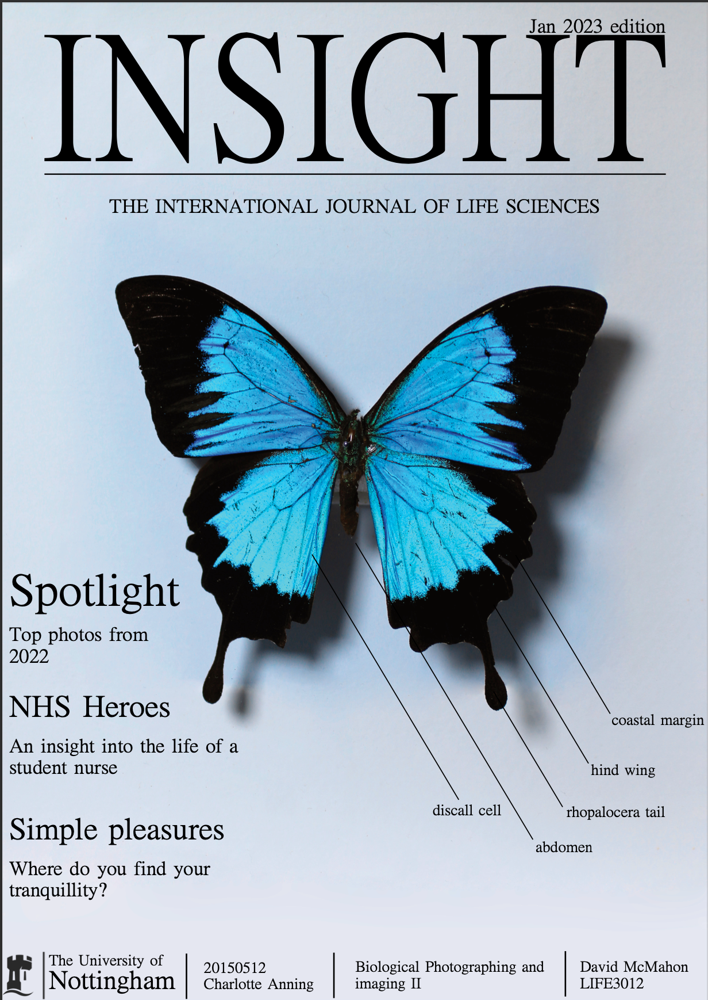
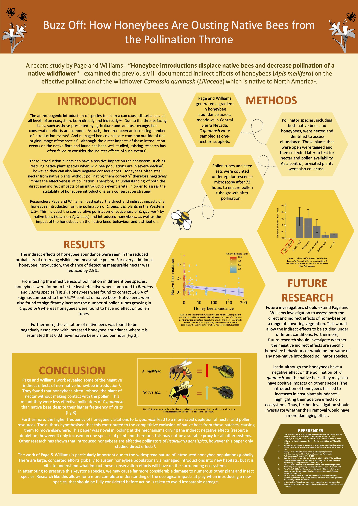
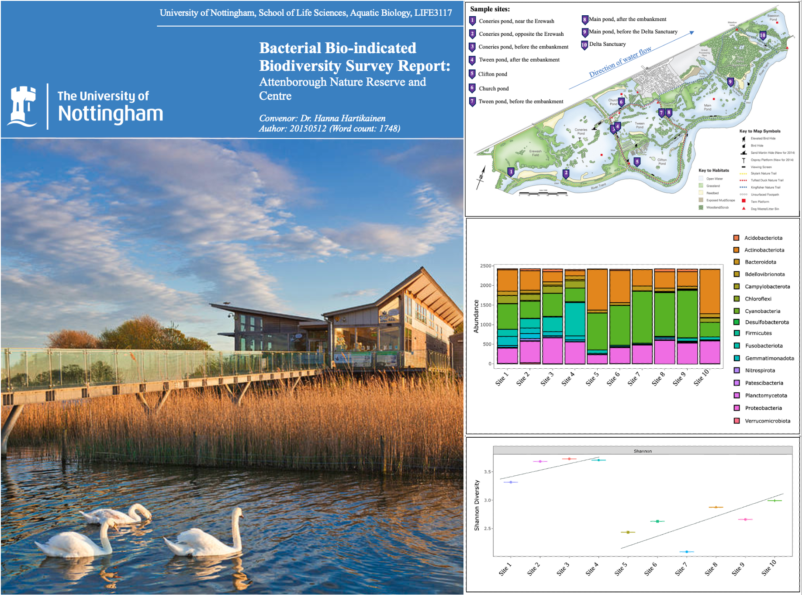

# Welcome!
Hello and welcome to my creative GitHub repository! I have added some examples of my best pieces of creative work, I hope you like them :)

Starting with my portfolio from a second year module in my Biology BSc undergrad called Biological Photographing and Imaging (BP&I for short). This is where I started to learn about my camera settings and how to capture the world around me. Flick through the directory above for all the pages.

Leading on from this is my portfolio for the third year sequel to the second year module - Biological Photographing and Imaging 2 (BP&I2 for short). Again flip through the above directory to see more! In this portfolio I built on the skills learnt from the second year module and wrote two articles, my favourite being the one on my housemate Katie who was a nursing student at the time.

Bee-cause you liked the first two, here is a poster I made for a Social Insects BSc Year 3 module about a North American bee war. I loved playing around with fun ways to present the data.

Here's some figures extracted from a biodiversity report I completed at the David Attenborough Nature Reserve in Nottingham! The aim of this survey was to detect whether a pollution gradient existed from the Erewash (a known site of entry of industrial waste runoff) to the Delta sanctuary where re-wilding efforts were creating a reduction in anthropogenic impact. A relative abundance gradient was discovered from the Erewash to Barton Lane and another from Barton Lane to the Delta Sanctuary indicating two possible sites where contaminants/pollutants were infiltrating the Reserve. I concluded both sites were being affected by human footfall and pollution.

